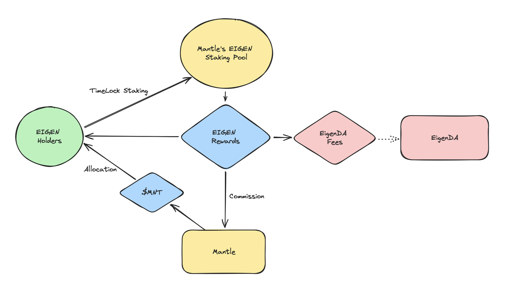

# Lastic

## Lastic Overstake

_Collective staking rewards for sustainable infrastructure._

### Abstract

Lastic Overstake allows current and future rollups to utilize community bootstrapping to fund their infrastructure costs with "overstaking." By collectively staking a DA provider's token and sending the rewards to sequencer costs for posting to modular DA layers, end-users can contribute to rollup infrastructure costs with the promise of benefits, fostering inter-community collaboration and rollup ecosystem bootstrapping.

### Background

##### Offsetting Infrastructure costs for Rollups

While there have been massive improvements in the ability to quickly build and deploy rollups, infrastructure costs are still quite high, especially if you're an independent team with little venture capital. The recent and continued explosion of Rollups has produced a demand and ample supply of dedicated Data Availability services such as EigenDA. An influx of DA providers have been able to launch solutions that offer very cheap DA services as an alternative to Etheruem CallData and blobs, so cheap that there is potential to get more than what is put in.

##### Cross-ecosystem community bootstrapping

Lastic enables collaboration between ecosystems in a novel, meaningful way. One good way to solve the plague of airdrop farming is to get meaningful contributions from new community members and Lastic provides just that.

### Overstaking

We propose a generalized, chain-agnostic model of where users of a PoS network contribute a portion of their staking rewards to elected rollups to overpay for their infrastructure costs in exchange for a promise of future rollup token allocations.

Lastic Overstaking allows collaboration between different infrastructure ecosystems that enables inclusive and accessible community funding of projects directly for their usage of various modular networks.

#### Overstaking for EigenDA on Mantle

**Example**: Let's assume a DA provider has a token with staking for securing their service a 10% APY and that a rollup needs to pay approximately $10/day for their DA needs. In order to completely subsidize the rollup's DA usage, they need to pool and lock at least $365,000 for the staking rewards to cover the costs.

Lastic created a bridged pool of EIGEN on Mantle Network where end-users can bridge-and- lock their EIGEN token for a pre-determined amount of time. In this scenario, Mantle Network has voted to use $MNT treasury funds to allocate to Lastic Overstakers who lock up their EIGEN to pay for Mantle's DA costs on EigenDA.

Once the Lastic Overstaking pool's rewards begin to fully offset the DA costs, excess rewards go back to the users minus the commission they agreed to before joining the Mantle Lastic Overstaking pool.

### Benefits 

#### For End-users:

 - Provides a useful and low-maintenance alternative to staking/delegating with extremely low opportunity costs
 - Have an increased chance of receiving Rollup tokens/airdrops
 - Can participate in the incentivizing of utilizing the users' token-derived blockspace/service

#### For Rollups, L2s:

Provides funds for not only completely subsidizing direct costs of blockspace usage, but also offsetting other indirect costs
Provides a novel community bootstrapping/growth mechanism by appealing to new active participants
Allows the potential of using commissioned/excess funds for prioritized inclusion in the future for a premium now (of which can easily covered with a low commission)

#### For Blockspace Providers:

 - Creates a new utility for their token
 - Incentivizes application usage in a sustainable, hands-off way (a complement, not a substitute to BP's foundation, integration and BD teams)
 - Allows users to voluntarily lock up those tokens for pre-determined extended periods of time
 - Reinvests new tokens issued directly back into the protocol

For this hackathon we use EigenDA and Mantle network as a first use-case of this model.

### Architecture plan

_TODO: Add additional functionality around the Lock up Eigen token that is on Ethereum._

#### Transaction Flow

_Add additional functionality around the Lock up Eigen token that is on Ethereum. Some of the rewards that would be minted would go back to be restaked (or user depends on the settings) and some of the rewards would go to fund other chains._

When the user would deploy lock up their tokens they would also get some voting LASTIC tokens that would allow them to determine with what layer 2 they want to support, or they could even delegate their vote to someone else.